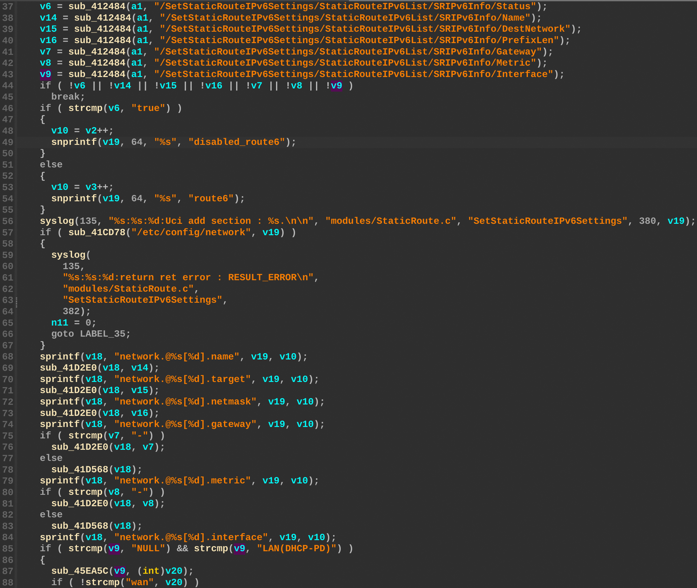
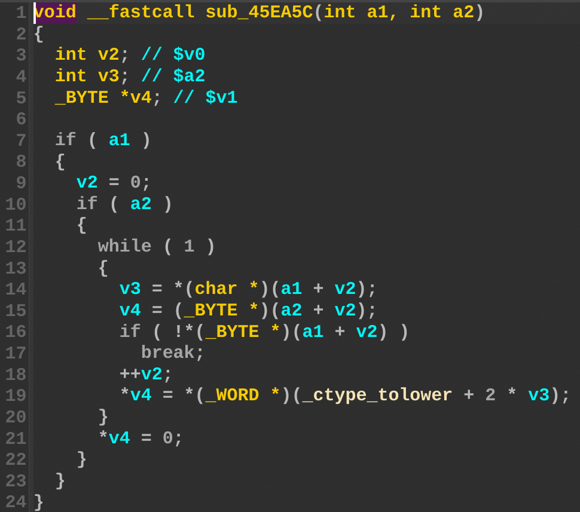

## Overview

- Manufacturer's website information: https://www.dlink.com/
- Firmware download address: http://support.dlink.com.au/Download/download.aspx?product=COVR-C1203&type=Firmware

## Affected version

COVR-C1203 1.08b10

## Vulnerability details

The D-Link COVR-C1203 firmware version 1.08b10 contain a stack-based buffer overflow vulnerability in the `SetStaticRouteIPv6Settings` function (`sub_45EAA8`). The vulnerability allows attackers to overwrite the stack via a crafted `/SetStaticRouteIPv6Settings/StaticRouteIPv6List/SRIPv6Info/Interface` parameter in a POST request. The `v9` variable receives the user-controlled interface input. This data is subsequently passed to `sub_45EA5C`, which performs a string lowercase transformation from `a1` to `a2` without validating the data length. This lack of boundary checks results in a stack overflow affecting the `v20` buffer.

