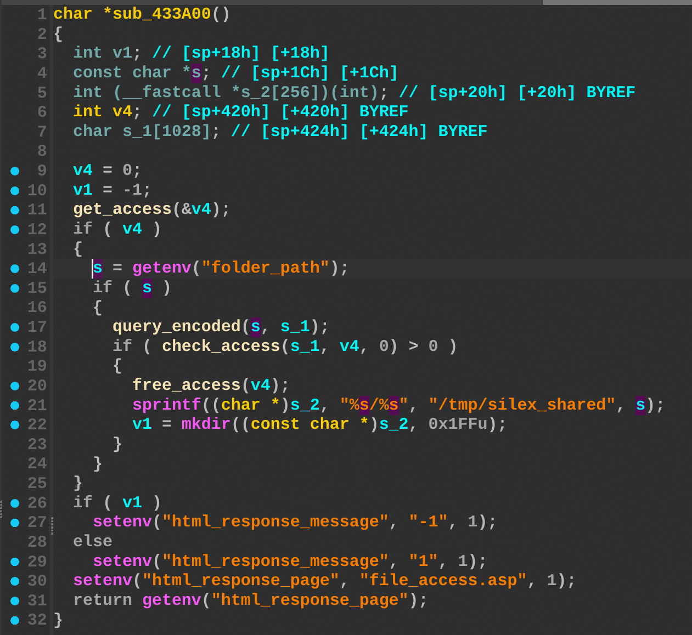
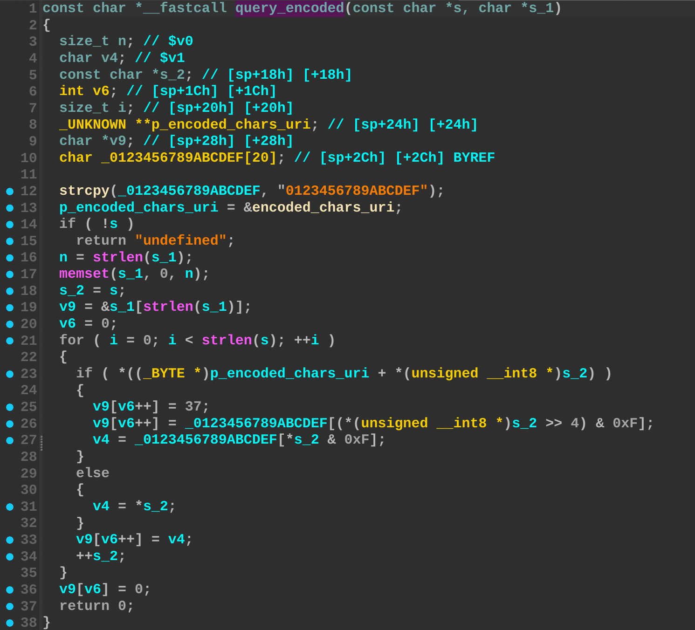
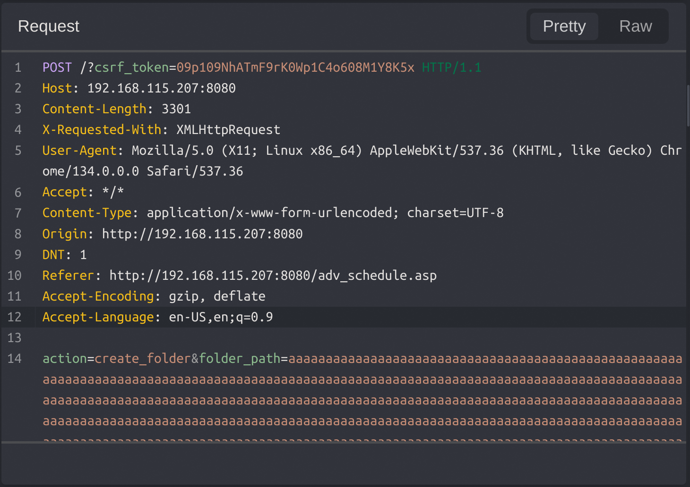
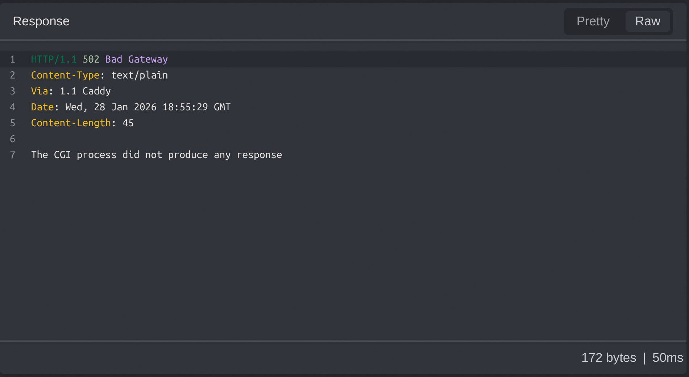

## Overview

- Manufacturer's website information: https://www.totolink.net/
- Firmware download address
  - http://downloads.trendnet.com/TEW-823DRU/firmware/
  - http://downloads.trendnet.com/TEW-827DRU/firmware/

## Affected version

TEW-823dru 1.02b01 and TEW-827dru 2.11B01

## Vulnerability details

The TRENDnet TEW-823DRU and TEW-827DRU contain a stack-based buffer overflow vulnerability in the `create_folder` function. The vulnerability allows attackers to overwrite the stack via a crafted `folder_path` parameter in a POST request. The `s` variable receives the user-controlled input. This data is subsequently passed to `query_encoded`, which performs a encoding operation from `a1` to `a2` without validating the data length. This lack of boundary checks results in a stack overflow affecting the `s_1` buffer.

## POC

