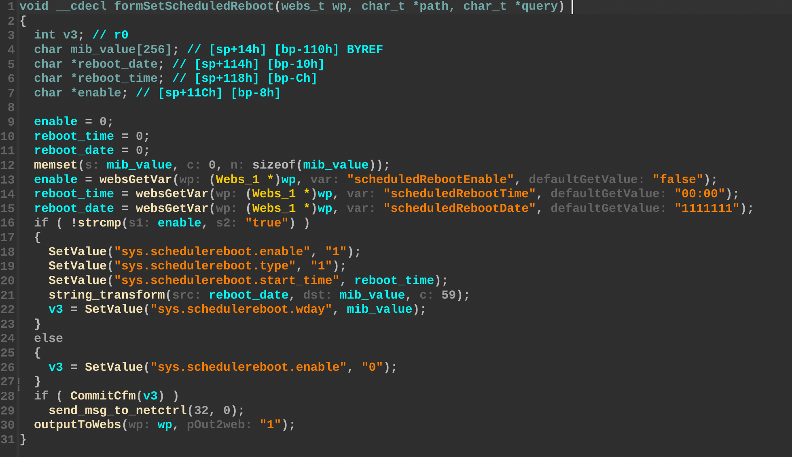
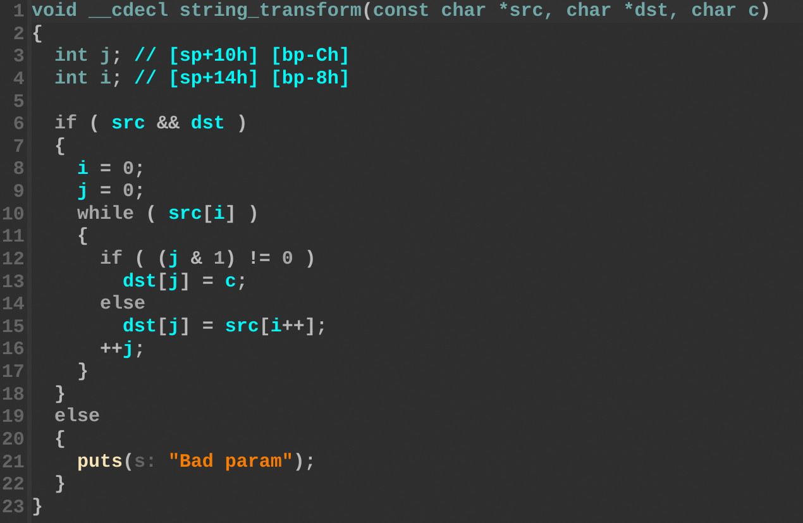

## Overview

- Manufacturer's website information：https://www.tendacn.com/
- Firmware download address ：https://www.tenda.com.cn/download/detail-2722.html

## Affected version

W15E V15.11.0.14

## Vulnerability details

The Tenda W15E firmware version V15.11.0.14 contain a stack-based buffer overflow vulnerability in the `formSetScheduledReboot` function. The vulnerability allows attackers to overwrite the stack via a crafted `scheduledRebootDate` parameter in a POST request. The `reboot_data` variable receives the user-controlled input. This data is subsequently passed to `string_transform`, which adds delmiters from `src` to `dst` without validating the data length. This lack of boundary checks results in a stack overflow affecting the `mib_value` buffer.

